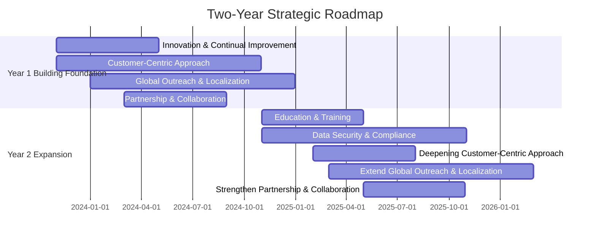
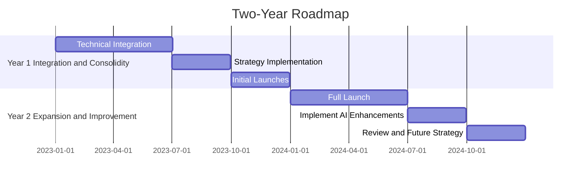
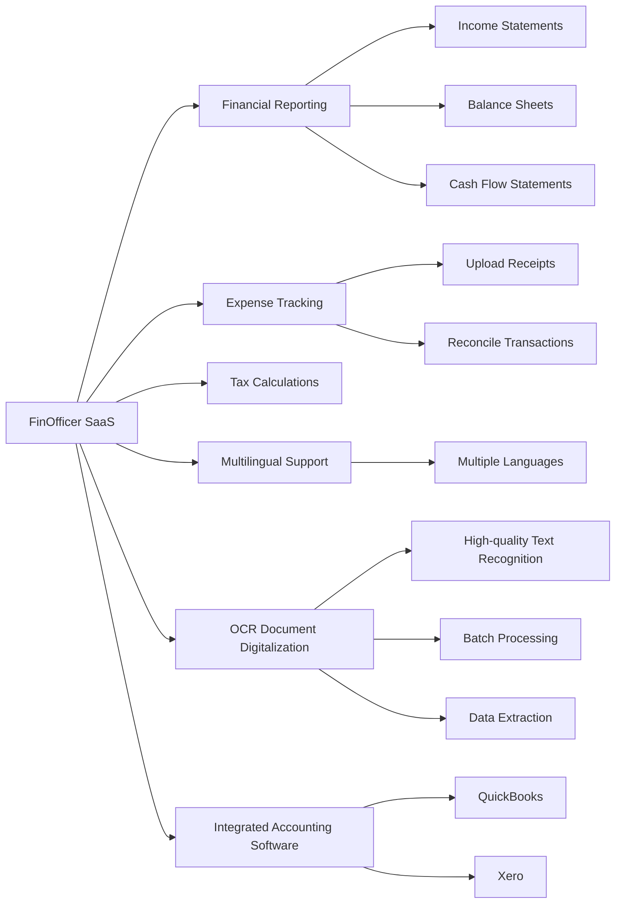

# www
www.finofficer.com


FinOfficer refers to a financial officer in an organization, such as a Chief Financial Officer (CFO) or a Financial Manager.

The FinOfficer *Saas is responsible for managing the financial operations and strategy of a company, including budgeting, financial planning, financial reporting, and financial analysis.

*SaaS stands for Software as a Service. It is a cloud-based software delivery model where software is hosted and provided by a service provider over the internet. SaaS eliminates the need for organizations to install and maintain software on their own hardware, and instead allows them to access and use software applications online on a subscription basis.


Integration with accounting software: The software should integrate with popular accounting software, such as QuickBooks or Xero, to streamline data transfer and report generation.

## Needs

Customers who run daily businesses and are too busy to handle accounting tasks likely expect:

1. A secure and reliable platform for managing their financial transactions,
2. Streamlined and automated invoicing and accounting process,
3. Easy tracking and management of their income and expenses,
4. Accurate and timely reports, 
5. Easy collaboration with their accountant, 
6. Compliance with regulatory requirements,
7. Simplified tax preparation,
8. Time and cost savings,
9. Peace of Mind - knowing that their financial administration is handled securely and efficiently.

Mission Statement: 

To provide simplified, secure and efficient financial management tools and solutions that empower businesses to focus on growth while we handle their accounting needs.


Vision Statement: 

To become the preferred security layer for financial transactions, setting the industry standard for financial management efficiency, security, and customer centric service, driving the success of businesses across the globe.


Strategy: 

Product Excellence
Continue to enhance and refine our secured SaaS platform, ensuring it remains at the cutting-edge of financial technology. Incorporate feedback from our users to drive product improvements.

Market Penetration
Reach out to small and medium businesses across multiple industries, positioning our platform as an essential tool for secure and streamlined financial management.

Partnership Building
Collaborate with leading accountants and financial advisors to enhance our offerings and credibility. Forge alliances with complimentary businesses for mutually beneficial relationships.

Customer Service
Deliver exceptional customer service, ensuring our clients feel supported and valued. Provide continuous education and resources to help them maximize the benefits of our platform.

Brand Recognition
Conduct targeted marketing and PR campaigns to enhance our visibility and reputation within the market. Build a strong, trusted brand synonymous with secure and efficient financial management.

Compliance and Security
Maintain rigorous data security standards and ensure compliance with financial regulations, reinforcing our commitment to protecting our users.

Staff Development
Invest in our team's skills and knowledge, fostering a culture of innovation and excellence. Encourage ongoing learning and reward outstanding performance.
   


## FinOfficer.com

Strategic roadmap, starting in November 2023.



The strategic actions start from November 2023 and stretch over the span of two years. Please note that the dates and duration are adjustable, based on your timelines.


[The Roles of Mission, Vision, and Values – Principles of Management](https://open.lib.umn.edu/principlesmanagement/chapter/4-3-the-roles-of-mission-vision-and-values/)


### Motto

"Empowering Financial Security."

### Tagline

"FinOfficer SaaS - Simplifying Finance, Amplifying Security."

### Quote

"With FinOfficer SaaS, experience the power of seamless finance management. It's not just a tool, it's your financial control center - designed to drive growth, efficiency, and success in your business."


### Mission Statement

Our mission is to provide businesses of all sizes with an intuitive, comprehensive, and reliable financial management solution. 
We strive to simplify financial operations, promote transparency, and automate processes, enabling our clients to focus on what truly matters - growing their business.

##### Mission statements, by answering question: Who we are? What we value?

We are FinOfficer SaaS, a dedicated and pioneering provider of cloud-based financial management solutions. 
We believe in the ethos of simplifying complex financial operations through innovation and technology. 
We value our customers' ambitions and uphold their success as our most crucial achievement.

We value integrity, maintaining transparency, trustworthiness and ethical practices in every interaction. 
We champion innovation, consistently pushing boundaries to enhance our offerings and user experience. 
We hold quality and excellence at the core of our services, striving to deliver high-standard and efficient solutions.

More than anything, we value relationships - be it with our customers, partners, or employees. 
We believe in the power of collaborative growth and mutual success. 
At FinOfficer SaaS, we empower businesses to take control of their finances, enabling them to focus on their growth and success - because we grow when our customers grow.

### Vision

Our vision is to be the foremost cloud-based financial management solution in the global marketplace, recognized for excellence, innovation, and the significant value we bring to businesses, shareholders, and communities. We aim to create a world where effective financial management is accessible, understandable, and manageable for everyone.


##### Vision statement, by answering question: what we want to become?

At FinOfficer SaaS, we aspire to become the global trailblazer in the world of cloud-based financial management solutions. 
We envision a future in which our industry-leading software is recognized for transforming financial operations of businesses of all sizes across the globe. 
We aim to set new standards of excellence and drive modernization in the sector.

Our goal is to create an accessible world where effective financial management is not a privilege, but a standard met for every business. 
We want our platform to be synonymous with reliable financial management, trusted by a global clientele, and contributing to the financial health and stability of businesses worldwide.

In essence, we strive to become an integral driver of success stories, helping businesses thrive and grow with streamlined, efficient, and innovative solutions.

### Strategy

+ How we will achieve our vision?

**Our Strategy:**

**Innovation and Continual Improvement:** We will stay vigilant to the latest technological advancements and continually refine and enhance our software to ensure our clients always have access to the most advanced, efficient, and reliable financial management solution.

**Customer-Centric Approach:** We will strive to understand the unique needs and pain points of our customers and develop tailored solutions that cater to their specific requirements. This includes investing in a strong customer support team that addresses queries and concerns promptly.

**Global Outreach and Localization:** Efforts will be undertaken to expand our presence in new markets across the globe. Localized strategies and customizations will be developed to cater to regional requirements, ensuring a seamless user experience for all our customers, regardless of geography.

**Partnership and Collaboration:** We will actively pursue strategic partnerships and collaborations that complement our offerings and extend our reach. This includes alignments with other tech companies, accounting software providers, and finance consultants.

**Education and Training:**
We will provide comprehensive training and educational resources to our customers, enabling them to leverage our software fully and effectively. This investment in our users' success will build loyalty and promote word-of-mouth referrals.

**Data Security and Compliance:** Rigorous measures will be taken to ensure data security and compliance with international standards and regulations. Trust in our platform's safety will be key to attracting new customers and retaining existing ones.

By adopting this multi-pronged and dynamic strategy, we aim to continually drive towards our vision of becoming the go-to global provider of cloud-based financial management solutions.


### Values

**Customer Centricity:** 
We put our customers' needs at the heart of everything we do; their success is our success.
   
**Innovation:** 
We foster a culture of innovation and continuous improvement, to constantly enhance our software's features and the customer experience. 

**Integrity:** 
Our actions are guided by honesty, reliability, transparency, and ethical practices.

**Empowerment:**
We aim to empower our clients by providing them with tools that promote self-sufficiency and robust financial management.

**Quality and Excellence:**
We persistently strive to provide high-quality software, exemplary services, and uphold standards of excellence.

**Collaboration:**
We believe in fostering strong relationships with all stakeholders - customers, partners, and employees - based on mutual respect and shared success.


## Roadmap




## FinOfficer ecosystem and features




## One Person Limited Companies

### 1. Functionality for Month and Annual Report 

#### Generate financial reports
The software should allow users to generate monthly and annual financial reports easily, including income statements, balance sheets, and cash flow statements.


#### Expense tracking
It should provide features to track and categorize expenses, including the ability to upload receipts and reconcile transactions.

#### Tax calculations
The software should be capable of calculating taxes and generating tax reports, helping one person limited companies stay compliant with tax regulations.

#### Profit and loss analysis
The system should provide tools to analyze profit and loss trends over time, helping businesses understand their financial performance and make informed decisions.

#### Cash flow management
It should assist in monitoring cash flow and projecting future cash flow needs.

#### Integration with accounting software
The software should integrate with popular accounting software, such as QuickBooks or Xero, to streamline data transfer and report generation.


### 2. Pricing for Month and Annual Report 

The pricing for such software typically varies based on the features offered and the size of the company. Subscription plans may include basic, premium, or advanced options, with corresponding price tiers. For example, a basic plan could start at $10-20 per month, offering essential report generation and expense tracking


## Corporations

### 1. Functionality for Month and Annual Report


#### Advanced financial reporting
The software should enable comprehensive financial reporting, including detailed income statements, balance sheets, and cash flow statements, with customizable templates and advanced filtering options.

#### Consolidation of financial data
The consolidation of financial data from multiple entities or subsidiaries, giving a holistic view of the corporation's financial performance.

#### Forecasting and budgeting
Provide tools for budgeting and forecasting, allowing corporations to set financial targets and track progress against them.

#### Multi-user collaboration
Support collaboration among team members, enabling multiple users to access and work on reports simultaneously.

#### Compliance and regulatory support
Assist in adhering to complex accounting standards and regulatory requirements, such as Generally Accepted Accounting Principles (GAAP) or International Financial Reporting Standards (IFRS).

#### Integration with ERP systems
Integrate with Enterprise Resource Planning (ERP) systems to streamline data transfer and enhance data accuracy.

Integration with accounting software: The software should integrate with popular accounting software, such as QuickBooks or Xero, to streamline data transfer and report generation.

### 2. Pricing for Month and Annual Report

The pricing for corporations typically depends on the size of the company, the number of users, and the complexity of features required.
Pricing models can include tier-based plans or customized enterprise-level solutions. Prices may range from a few hundred dollars per month for smaller corporations to thousands of dollars per month for larger enterprises. Contracts might also include additional services like implementation support, training, and dedicated account management.


## Use Cases

#### IT Consulting Firm:
Fin Officer helps an IT consulting firm optimize their financial operations by providing comprehensive expense tracking, budgeting, and financial reporting. The firm can easily analyze project costs, track expenses, and generate accurate client invoices, resulting in improved profitability and streamlined financial management.

#### Software Development Company:
Fin Officer enables a software development company to efficiently manage their project budgets, track development costs, and monitor cash flow. By integrating with their accounting software, they can automate financial processes, such as generating financial statements and reconciling transactions, saving time and improving accuracy.

#### Cloud Service Provider:
With Fin Officer, a cloud service provider gains visibility into their financial performance with real-time reporting and analysis. They can track revenue streams, manage expenses, and monitor profitability across their various services. The platform's forecasting and budgeting capabilities allow the company to plan for growth and optimize resource allocation.

#### IT Security Company:
Fin Officer helps an IT security company streamline their financial workflows, including expense tracking, tax calculations, and financial planning. The platform's OCR document digitalization ensures efficient processing of invoices, receipts, and other financial documents, reducing manual data entry errors and increasing productivity.

#### Data Analytics Firm:
Fin Officer provides a data analytics firm with a centralized financial management solution, integrating with their existing analytics tools. The platform's advanced reporting features and profit and loss analysis enable them to track revenue, expenses, and profitability by client, project, or department. This data-driven approach allows for informed decision-making and strategic financial planning.

#### IT Training Provider:
Fin Officer simplifies financial operations for an IT training provider by automating expense tracking, generating invoices, and managing student payments. The platform's integration with their learning management system facilitates accurate financial record-keeping, while its multi-currency support enables seamless international transactions.

These use cases highlight how Fin Officer caters to the financial management needs of various IT companies, improving efficiency, providing real-time insights, and enabling informed decision-making.


#### Customer Success Story

XYZ Tech Solutions, a leading IT consulting firm, faced challenges in effectively managing their financial operations and gaining visibility into their project budgets and expenses. They needed a solution that could streamline their financial workflows, automate processes, and provide comprehensive reporting.

Enter FinOfficer SaaS, a cloud-based financial management solution. XYZ Tech Solutions implemented FinOfficer to enhance their financial operations and achieve greater efficiency. The results were transformative.

With FinOfficer, XYZ Tech Solutions gained the ability to effortlessly track project costs, monitor expenses, and generate accurate client invoices. The integrated expense tracking feature allowed them to meticulously record project-related expenses, ensuring accurate project costing and improved profitability.

FinOfficer's budgeting and financial planning capabilities empowered the firm to proactively manage project finances. They could set budgets for each project and track actual costs against planned budgets in real-time. This allowed them to identify any budget variances early on, make necessary adjustments, and optimize resource allocation for maximum profitability.

The advanced reporting and analytics functionalities of FinOfficer enabled XYZ Tech Solutions to gain valuable insights into their financial performance. They could easily generate comprehensive financial reports, including income statements, balance sheets, and cash flow statements, providing them with a clear understanding of their financial health and aiding in strategic decision-making.

Moreover, the seamless integration of FinOfficer with their existing accounting software eliminated the need for manual data entry and reduced the risk of errors. This integration ensured accurate financial data transfer, saving time and further enhancing data accuracy.

Since implementing FinOfficer, XYZ Tech Solutions has experienced significant improvements in their financial management processes. The firm has achieved greater efficiency, improved cost control, and enhanced profitability. With a consolidated and automated financial management platform, they can now focus more on their core consulting services and provide exceptional value to their clients.

FinOfficer has truly transformed XYZ Tech Solutions' financial operations, empowering them to achieve success and growth in a highly competitive industry.


## DOC

MVP specification for building functionality in the Command and Query Responsibility Segregation (CQRS) pattern using Python classes:
[CQRS pattern - Azure Architecture Center | Microsoft Learn](https://learn.microsoft.com/en-us/azure/architecture/patterns/cqrs)


### 1. Command Handler Class:
- Responsible for handling write operations or commands.
- Should have methods for each specific command.
- Receives the command as the input parameter and processes it accordingly.
- Performs business logic and updates the appropriate data models or services.

### 2. Query Handler Class:
- Responsible for handling read operations or queries.
- Should have methods for each specific query.
- Receives the query as the input parameter and retrieves the required data.
- Performs any necessary filtering, sorting, or aggregation on the data.

### 3. Command Model:
- Represents the data model for write operations or commands.
- Includes attributes that define the necessary fields for a command.
- Can have methods to validate and transform the data before persisting it.

### 4. Query Model:
- Represents the data model for read operations or queries.
- Includes attributes that define the required fields for a query response.
- Can include methods to format or transform the data before returning it.

### 5. Command Bus:
- Responsible for routing commands to the appropriate command handler.
- Maps the incoming command to the corresponding handler method based on the command type.
- Initiates the command processing and updates the data accordingly.

### 6. Query Bus:
- Responsible for routing queries to the appropriate query handler.
- Maps the incoming query to the corresponding handler method based on the query type.
- Executes the query processing and returns the requested data.

### 7. Repository:
- Responsible for persisting and retrieving data from the underlying storage.
- Provides methods to save, update, delete, and retrieve data models.
- Can implement an ORM (Object-Relational Mapping) for interacting with the database.

These classes form the foundation of the CQRS pattern implementation in Python and allow separation of write operations from read operations, improving scalability and performance.


## Data Models

the data models for the "Functionality for Month and Annual Report for One Person Limited Companies":

### 1. ReportData:

- report_id: int (auto-generated unique report identifier)
- company_name: str (name of the company)
- report_type: str (type of report, e.g., monthly or annual)
- report_year: int (year for the report)
- report_month: int (month for the report)
- income_statement: IncomeStatement (income statement data)
- balance_sheet: BalanceSheet (balance sheet data)
- cash_flow_statement: CashFlowStatement (cash flow statement data)
- tax_report: TaxReport (tax report data)


### 2. IncomeStatement:

- revenue: float (total revenue in the report period)
- expenses: float (total expenses in the report period)
- net_income: float (net income calculated from revenue and expenses)

### 3. BalanceSheet:
   
- assets: float (total assets of the company)
- liabilities: float (total liabilities of the company)
- equity: float (total equity of the company)

### 4. CashFlowStatement:
   
- operating_cash_flow: float (cash flow from operating activities)
- investing_cash_flow: float (cash flow from investing activities)
- financing_cash_flow: float (cash flow from financing activities)
- net_cash_flow: float (net cash flow calculated from all activities)

### 5. TaxReport:
   
- tax_expenses: float (total tax expenses for the company)
- tax_liabilities: float (total tax liabilities for the company)
- tax_paid: float (total tax paid by the company)

Note: You can further customize and add more fields to these data models based on the specific requirements of your application. Additionally, you may consider defining relationships between data models if needed, such as a one-to-one relationship between ReportData and the other data models.


## Environment

+ Docker
+ docker-compose.yaml

  
In this docker-compose.yml, two services are defined: app and db. The app service builds the Docker image using the Dockerfile in the current directory. The volumes line specifies that the app folder should be mounted to the /app folder in the container. The app is mapped to port 8000.

The db service creates a Postgres database instance using the official Postgres Docker image. The Postgres container is given the environment variables for the Postgres user, password, and database. 

You can initiate the services by using the command `docker-compose up --build`.


## npm

npm install axios
npm install vue-router

install Vue Router if it's not already installed, these pages use Vue Router for navigation.

Please remember to replace `'/api/login'` and `'/api/subscribe'` with your actual API endpoints.

Keep in mind this is just basic functionality, you'll want to handle API responses properly by providing user feedback and error handling.


## Install

```bash
./install.sh
```

This script updates the package manager and installs Node.js, npm, Docker, and Docker Compose. It then clones the repository, sets up the Docker containers, installs dependencies for the Vue.js application, and starts the application. Finally, it outputs a success message once everything is set up and running.


## Content


### Keywords

Financial Management, Cloud-based Solution, Reporting, Expense Tracking, Tax Calculations, Profit and Loss Analysis, Cash Flow Management, Integrations, Usability, Multilingual Support, OCR Document Digitalization, High-Quality Text Recognition, Data Extraction, Batch Processing, Pattern Recognition, Machine Learning, Artificial Intelligence, Enhanced Data Accuracy, Secure Platform, User-Friendly Interface, Streamlined Operations, Scalability, Collaboration, Compliance and Regulatory Support, Forecasting and Budgeting.


comptroller
bookkeeper
controller
auditor
certified public accountant
bean counter
cashier
bursar
banker
analyst
actuary

auditor
calculator
clerk
purser
teller
treasurer
chartered accountant
paymaster
banker
number cruncher
reckoner
accounting

financial officer

accountancy
book keeper
public accountant
receiver


account

business manager
certified public account
financial executive
statistician
arithmetician

geometer

mathematician

book-keeper

cost accountant
geometrician
numerical analyst
collector

accountable
examiner
financier
state-licensed accountant
accountants
assessor

auditors

chamberlain
controllers

steward
trustee
administrator
controller
inspector

manager
scribe
theoretician
accounting firm

archivist
booker
couch doctor
cpa
head shrinker
ledger
liquidator
mathematical worker
officer


### html


**Home Page**
```html
<meta name="description" content="FinOfficer SaaS, your premier cloud-based financial management solution. Simplify & automate complex financial operations, experience seamless usability & advance to a higher level of efficiency. Explore our cutting-edge features today.">
<meta name="keywords" content="Financial Management, Cloud-based Solution, Expense Tracking, Tax Calculations, Cash Flow Management, OCR Document Digitalization, Data Extraction, Artificial Intelligence, Machine Learning">
```

**Contact Page**
```html
<meta name="description" content="Get in touch with the FinOfficer SaaS team for expert advice, customer support or any questions about our cloud-based financial management software. We're here to help you streamline your financial operations & achieve business excellence.">
<meta name="keywords" content="Contact, FinOfficer SaaS, Customer Support, Query, Help, Assistance, Cloud-based financial management, Financial Operations, Business Excellence">
```

**Partners Page**
```html
<meta name="description" content="Find out about our strategic partnerships and how we collaborate to achieve mutual growth & success. Interested in partnering with us? Explore opportunities to get on board with FinOfficer SaaS, your trusted Financial Management Solution.">
<meta name="keywords" content="Partnerships, Collaboration, Success, Strategic Alliances, Partner with us, Financial Management Solution">
```

**Customers Page**
```html
<meta name="description" content="Our customers are our lifeblood at FinOfficer SaaS. Learn about their experiences, successes and how our financial management software has transformed their businesses. Join our customer base & elevate your financial management capabilities.">
<meta name="keywords" content="Customers, Customer Success, Success Stories, Testimonials, Financial Management Software, Financial Transformation">
```

**Use Cases Page**
```html
<meta name="description" content="Understand how FinOfficer SaaS can integrate with your business through real-world use cases. Discover how our financial management tool has solved complex financial challenges and delivered substantial efficiency to businesses.">
<meta name="keywords" content="Use Cases, Real-world examples, Business Integration, Financial Challenges, Efficiency, Financial management tool">
```


